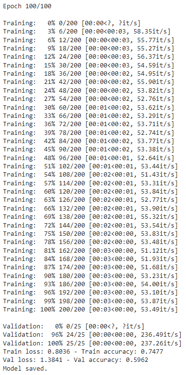
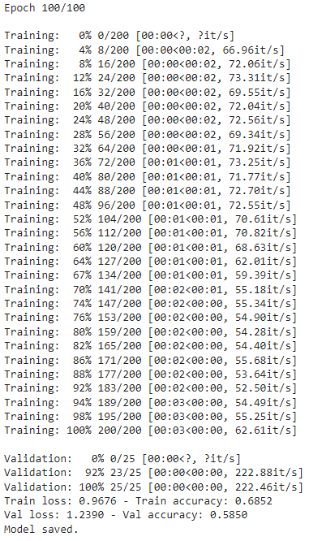
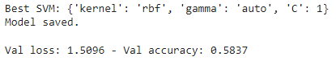
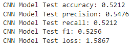
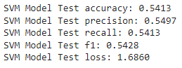

## Musical genres recognition of the "fma_small" dataset

This is a machine learning project realized for the Machine Learning course at UniKore. It provides a basic structure for a machine learning project, including a `README.md` file, a `requirements.txt` file, and a structure for the code.

| | |
| --- | --- |
| **Description** | Machine learning project for musical genres recognition |
| **Author** | Luigi Pio Faletra |
| **Course** | [Machine Learning @ UniKore](https://unikore.it) |
| **License** | [MIT](https://opensource.org/licenses/MIT) |

---

### Table of Contents

- [Machine learning project for musical genres recognition](#musical-genres-recognition-of-the-fma_small-dataset)
  - [Table of Contents](#table-of-contents)
  - [Introduction](#introduction)
  - [Requirements](#requirements)
  - [Code structure](#code-structure)
  - [Results](#results)
  - [License](#license)

---

### Introduction

The project focuses on classifying musical genres using the smallest [FMA](https://github.com/mdeff/fma) dataset, known as `fma_small`. It employs various machine learning models, including a Support Vector Machine (**SVM**), based on a Feedforward Neural Network (**FFNN**), and a Convolutional Neural Network (**CNN**).

The project is divided into two main scripts:
- `train.py` for training and validate the model.
- `test.py` for testing the model.

The dataset consists of 8000 audio files, divided into 156 folders named **000**, **001**, ... , **010**, **011**, ... , **099**, **100**, ... , **154**, **155**.

Inside the `tracks.csv` file, contained in the compressed archive `fma_metadata.zip`, the audios have already been divided into training, validation, and tests, in the following way:
- 6400 audios for training.
- 800 audios for validation.
- 800 audios for testing.

The **musical genres** to be classified are:
- Electronic.
- Experimental.
- Folk.
- Hip Hop.
- Instrumental.
- International.
- Pop.
- Rock.

The dataset is managed by the `fma_dataset.py` class, while the models are defined in the `cnn_model.py` and `ffnn_model.py` classes. The SVM model is implemented by calling the `SVC` class from the scikit-learn library.

The main idea is that, the project can be reproduced by running the following commands in separate cells on [Google Colab](https://colab.research.google.com):

```bash
!git clone https://github.com/LuigiPioFaletra/Machine-Learning-Project
```
```bash
%cd Machine-Learning-Project
```
```bash
%%bash prepare.sh
```
```bash
!python3 train.py --config config/base_config.yaml
```
```bash
!python3 test.py --config config/base_config.yaml
```

The `prepare.sh` script is used to install the requirements for the project and, optionally, to set up the environment (e.g., download the dataset, download the metadata, etc.). The project should be self-contained and reproducible by running the above commands.

---

### Requirements

The project is developed using **Python 3.10** - one of the latest versions of Python at the time of writing.

Dependencies are listed in the `requirements.txt` file and can be installed with the command `pip install -r requirements.txt`.

You may want to modify the requirements file to remove unnecessary dependencies or add new ones. This template is based on the following libraries:
- `addict` for nested dictionaries.
- `joblib` for trained models saving.
- `librosa` for audio analysis and processing.
- `numpy` for scientific computing.
- `pandas` for data manipulation.
- `PyYAML` for reading and writing YAML files.
- `scikit-learn` for machine learning algorithms.
- `torch` for deep learning.
- `tqdm` for progress bars.
- `transformers` for pretrained models.
- `yaml_config_override` for overriding YAML configurations.

---

### Code structure

The code is organized as follows:

```
main_repository/
│
├── config/
│   ├── base_config.yaml
│
├── data_classes/
│   ├── fma_dataset.py
│
├── extract_representations/
│   ├── audio_embeddings.py
│
├── model_classes/
│   ├── cnn_model.py
│   ├── ffnn_model.py
│
├── npy_files/
│   ├── test_embeddings.npy
│   ├── test_labels.npy
│   ├── training_embeddings.npy
│   ├── training_labels.npy
│   ├── validation_embeddings.npy
│   ├── validation_labels.npy
│
├── results/
│   ├── cnn_test.png
│   ├── cnn_training_and_validation.png
│   ├── ffnn_test.png
│   ├── ffnn_training_and_validation.png
│   ├── svm_test.png
│   ├── svm_validation.png
│
├── .gitignore
├── LICENSE
├── prepare.sh
├── README.md
├── requirements.txt
├── test.py
├── train.py
└── utils.py
```

- `config/` contains the file for variables configuration for training, validation and test.
- `data_classes/` contains the class for managing the dataset.
- `extract_representations/` contains the class for audio features extraction.
- `model_classes/` contains the classes for the models design.
- `npy_files/` contains binary files with embeddings and labels extracted from the training, validation and test datasets.
- `results/` contains the results obtained in the training, validation and testing phase for the CNN and FFNN models and those in the validation and testing phase for the SVM model.
- `.gitignore` specifies which files and folders should be ignored from the Git version control system.
- `LICENSE` contains the project’s license information.
- `prepare.sh` is a script for setting up the environment - at the moment it only installs the requirements.
- `README.md` is the file you are currently reading.
- `requirements.txt` contains the list of dependencies for the project.
- `test.py` is the script for testing the model.
- `train.py` is the script for training and validate the model.
- `utils.py` is the script that contains utility functions used across the project.

---

### Results

This section shows the **training and validation results** of the three implemented models:

**CNN**



**FFNN**



**SVM**



And here are the **test results** of the same models:

**CNN**



**FFNN**


**SVM**



---

### License

This project is licensed under the terms of the MIT license. You can find the full license in the `LICENSE` file.